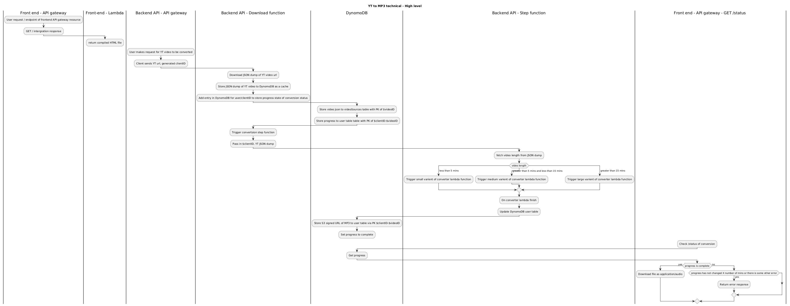

## Youtube to MP3 converter

### Inspiration

There a few "YT to MP3 converters" available but all of them is quite trash,
full of ads and very likely malware infested files. So i created my own
converter.

### Usage

**Demo:** [Video](https://youtu.be/3QPW_p4SECQ) Front end:
https://github.com/Echo-Peak/yt-video-to-mp3-web

### Architecture

This is a 2 part project. The front end being a simple static react SPA hosted
via GitHub pages. The backend is a AWS cloudformation stack using AWS SAM.

The idea of the backend is to leverage a lambda function, triggered via API
gateway, to determine how much resources the input video source url will
require. This lambda function "prepareConversion" will then trigger a state
machine which evaluates the duration string of the given video. Depending on the
duration, a lambda function with specified resources will then be triggered to
download the video via yt-dlp and process it via ffmpeg to extract audio.

Once the audio is extracted, its send to S3 and a signed url is then created as
added to the DB.

A DB (dynamoDB) is used to facilitate the caching of videos and the state of a
given video per user.

The front end, the react SPA, will poll the backend API every 5 seconds, while a
conversion is in progress, which will trigger the "queryStatus" lambda function.
This function uses the user credentials + video id and queries the DB to check
MP3 conversion state. If conversion is complete, the lambda will return a
download link (the signed url of the MP3 file)

